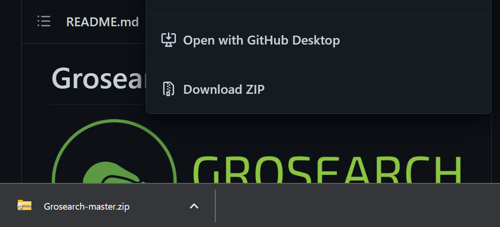
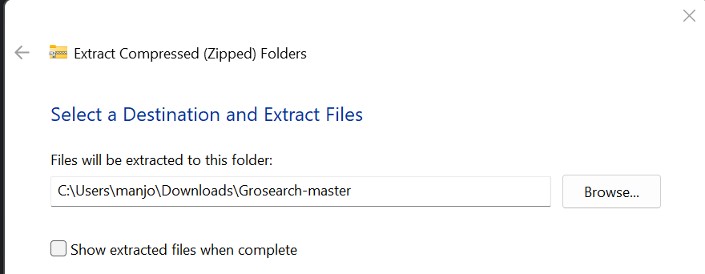
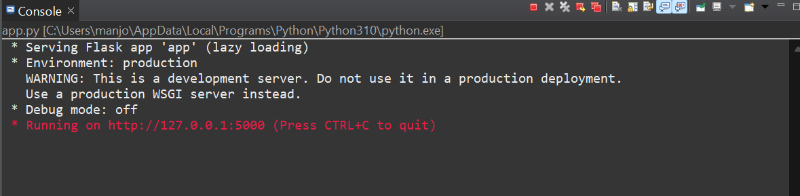
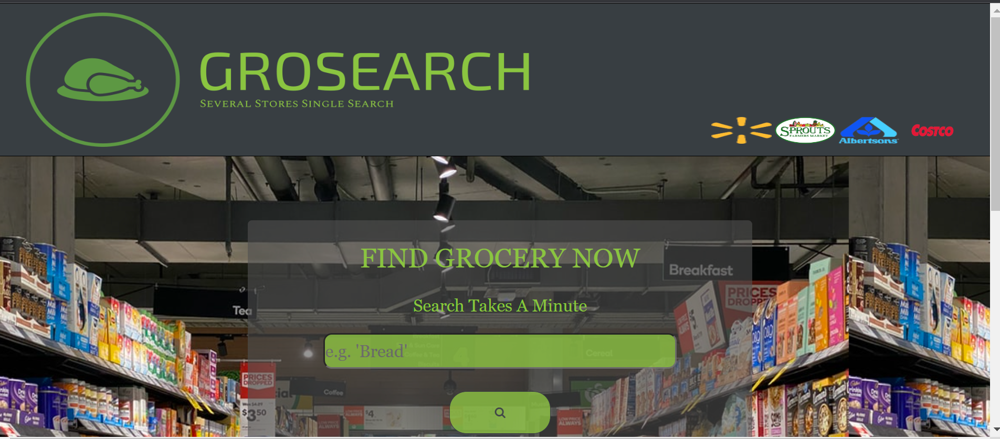
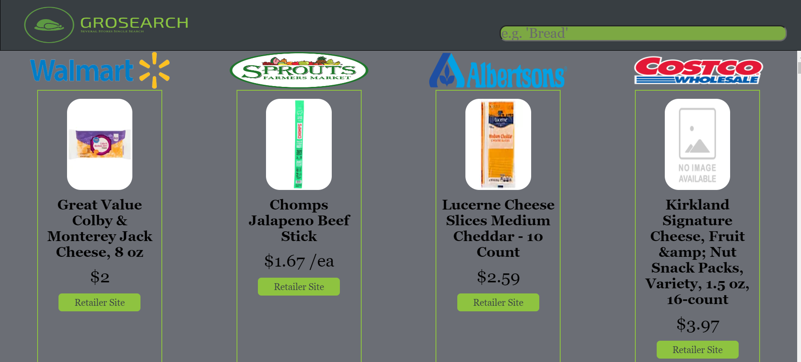

# About
Searching for grocery across multiple websites has always been cumbersome due to redundant typing, and tabs cluttering the browser. Now is the time to simplify, and declutter. Welcome to Grosearch, a application with a powerful singular search able to traverse through several stores displaying popular products to users while focusing in on budgeting and low prices. Grosearch seeks to foster an enviornment where money and time is saved alongside stopping digital headaches. 

# Mission
Develop a singular search able to encompass several retailers displaying their products together for straightforward comparison with emphasis on limited budgeting

# Features
* Powerful singular search encompassing several retailers and products
* Easy to navigate graphical interface 
* Displays popular products sorted by lowest price by default
* Products formated graphically side-by-side emphasizing readability 
* Local host based only requiring outbound connections to authorized retailers

# Low Prices Guranteed
A glaring issue about the displayed products that may arise at first sight is the lack of personalized options for sorting. This was done by design as Grosearch seeks to focus on budgeting, and sorting features have been ommited as it is assumed users are seeking the lowest prices with less emphasis on other categories. Grosearch is catered towards students, and anyone else who is seeking to save money. 

# Partner Stores
The Stores have been selected based upon accessibility. The communications with Walamrt is established by uttilization of their Application Programming Interface. Alternatively the communications with Sprouts, CostCo, and Alberstons was established by scraping their publicly available data off their websites respectively. All rights are reserved to them, I do not seek personal monetary gain from this application. Links to retailer wesbites hosting the product have been provided if users are intrested in purchasing a displayed product.

# Requirements
* Python (Selenium, Requests, JSON, Flask) 
* Python Interpreter
* Network Connection
* Browser

# Installation
1. Download the repository in its entirety, it should be formatted as a zip file

2. Unzip the repository into your local users download folder, this is nessecary

3. Open the folder Grosearch_Application through your respective interpreter
4. Follow the user guide below

# User Guide
1. Within the Grosearch_Application folder open in interpreter find the app.py module
2. Assuming nessecary modules are installed (ex. pip install selenium, in command prompt) run app.py as a Python File
3. Within the respective console will display something simmilar to the image below

4. Open your browser, and visit your local host by searching http://127.0.0.1:5000
5. Ensure the program is still running as it will not work if running is paused or stopped within interpreter
6. The application should preseent a landing page at your local connection (http://127.0.0.1:5000) like the one below:

7. From here preform a search on the desired product, it may take anywhere from 40-70 seconds due to intensive nature of scraping many sites. Alterntively visit the links at the bottom of the page to learn more about the application, and development
8. After the search is complete a page will be displayed in a table format including stores logos on the top of each column with products underneath, scroll through comparing products and visiting the retailer sites for the ones needed. Also from this search page further searches for more products can be done in the top-right hand corner. The Grosearch logo will lead back to the landing page, and links for further information are avaiable at the bottom of the application 

9. Once done stop the process from the interpreter and local host should be disengaged and cleared of Grosearch

# Technology 
## Python
* Used to develop back-end of application providing a stable foundation for implementation of modules and future 
## HTML
* Provides foundation and structure for graphical interface of application displaying data via Jinja2 
## CSS
* Adds graphical, and themeatic accents upon html structures to make site more user-friendly
## Flask
* Creates a tether between Python and HTML/CSS allowing data to be registerd, interpreted and displayed
## Selenium
* Utilized as a versatile web scraper able to scrape several wesbites at an efficent rate mimicking scrolls, and clicks

# Contributions 
Grosearch is open-source and will benefit greatly if given the chance from community contribution. The process would include creating a branch from the master, and then adding a new store module (ex. Target.py). From there the module requires one function a scrape of any variety that is able to get products within a list format with each product being nested either as a dictionary or JSON (Price, Image, Retailer Link, Title). Ensure the function returns the list. After that update the app.py module within the catch() functions return statement:
flask.render_template('search.html', (Insert Store Here)-data = (New Store).DataCapture(item), ...). Remember to import the new store module at the top of app.py. Following that update Search.html and add a new table below the previous tables mimicking their structure, but with the flask passed variables that hold the new product list. When store is sucsessfully incorporated, and displaying products ensure that the companys logo is displayed on the landing page, and credit is given. Congratualtions you have expanded the scope, and accessbility of Grosearch. Thank you. 

# Future
Grosearch will expand its collection of products, and stores through contributions encompassing more of the digital frontier. I hope to expand the format of application beyond local hosting by developing a light-weight graphical user interface based upon Python using the Qt package in order to make installation and usage faster, and clearer. 

